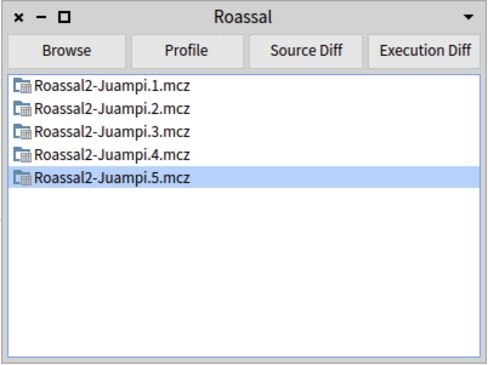

# Performance Evolution Matrix
This repository contains the artifacts needed to replicate our experiment in the paper "Performance Evolution Matrix".


# Baseline

The baseline contains the tools and the project-dataset to realize the tasks described in the paper (identifying and understanding performance variations).

## Open the Baseline

**MacOSX.** We do all the experiments in a Mac Book Pro. To open the Baseline execute the following command in the folder where this project was downloaded. 

```
./Pharo-OSX/Pharo.app/Contents/MacOS/Pharo Baseline.image
```

**Windows.**
You may also run the experiment in Windows, but depending on the windows version you have installed it may be some some UI bugs.
```
cd Pharo-Windows
Pharo.exe ../Baseline.image
```

## Open a Project

There are three projects under study, depending on the project you wanna use for the task, you may execute one of the following scripts. For executing a script press Cmd-d or right-click and press do it.

**Roassal**
```
TProfileVersion openRoassal.
```

**XML**
```
TProfileVersion openXML.
```
**Grapher**
```
TProfileVersion openGrapher.
```

## Baseline Options
For each project, we provide a UI which contains all the tools we use as a baseline. Each item in the list is a version of the selected project.



- Browse: open a standard window to inspect the code of the project in the selected version.
- Profile: open a window with a call context tree for the selected version.
- Source Diff: open a window with the code differences between the selected version and the previous one.
- Execution Diff: open a window with the merge call context tree gathered from the selected version and the previous one.

# Matrix

## Open Matrix Image.

**MacOSX.** We do all the experiments in a Mac Book Pro. To open the Matrix execute the following command in the folder where this project was downloaded. 

```
./Pharo-OSX/Pharo.app/Contents/MacOS/Pharo Matrix.image
```

**Windows.**
You may also run the experiment in Windows, but depending on the windows version you have installed it may be some some UI bugs.
```
cd Pharo-Windows
Pharo.exe ../Matrix.image
```

## Open a project

There are three projects under study, depending on the project you wanna use for the task, you may execute one of the following scripts. For executing a script press Cmd-d or right-click and press do it.

**Roassal**
```
ToadBuilder roassal.
```

**XML**
```
ToadBuilder xml.
```
**Grapher**
```
ToadBuilder grapher.
```

# Data Gathering

Before each participant starts a task we execute the following script in Smalltalk. For executing a script press Cmd-d or right-click and press do it. It allows us to track the time that a user starts the experiment and how many mouse clicks, movements.
```
UProfiler newSession.
UProfiler current start.
```

After finishing the task we executed the following script. It stop recording the mouse events and save the stops time.
```
UProfiler current end.
```

The last script generates a file with the following information: start time, end time, number of clicks, number of mouse movements, and the number of mouse drags (we do not use this last one).
```
11:34:52.5205 am,11:34:56.38016 am,14,75,0

```
# Quit
To close the artifact, just close the window or press click in any free space of the window and select quit.

# Video Demo
[link](https://github.com/jpsandoval/PerfEvoMatrix/blob/master/MatrixMovie.mp4)
